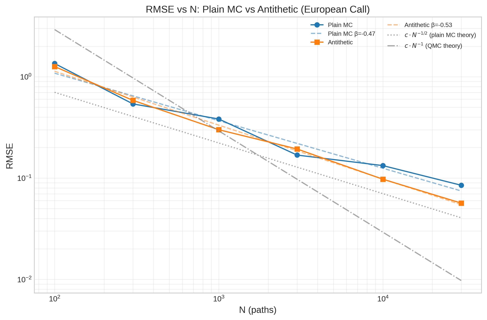
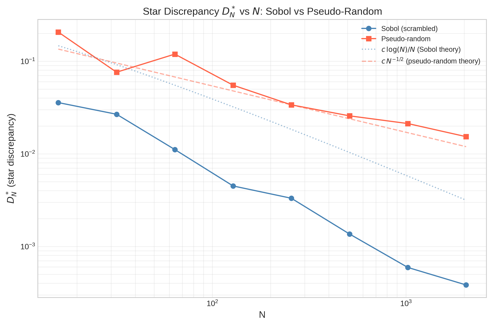
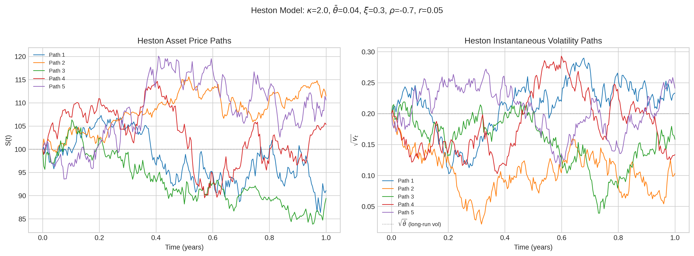

# Monte Carlo Option Pricer

Python implementation of Monte Carlo simulation for pricing path-dependent options (Asian, barrier, lookback, digital) with variance reduction techniques. Built from scratch with NumPy/SciPy.

## What This Does

Prices exotic options under both the Black-Scholes (GBM) and Heston stochastic-volatility models. Benchmarks four variance reduction methods — antithetic variates, control variates, importance sampling, and quasi-Monte Carlo (Sobol) — across multiple sample sizes, with convergence rate analysis.

## Mathematical Background

### Risk-Neutral Pricing

Under the Black-Scholes model, the asset price follows:

```
dS = (r - q) S dt + σ S dW_t
```

The risk-neutral price of a contingent claim with payoff `h(S)` is:

```
V(0) = e^{-rT} E_Q[h(S_T)]
```

Monte Carlo approximates this expectation by the sample average:

```
V̂_N = e^{-rT} (1/N) Σ h(S^{(i)}_T)
```

with standard error `SE = σ_h / √N` (CLT, convergence rate `O(N^{-1/2})`).

### Discretisation: Log-Euler Scheme

The GBM is simulated exactly (no discretisation error) via:

```
S(t + Δt) = S(t) · exp((r - q - σ²/2) Δt + σ √Δt · Z)
```

where `Z ~ N(0,1)`. This is the exact solution to the SDE.

## Options Implemented

| Option | Payoff | Analytic benchmark |
|--------|--------|--------------------|
| European call/put | `(S_T - K)⁺` | Black-Scholes (1973) |
| Digital call | `1{S_T > K}` | `e^{-rT} N(d₂)` |
| Arithmetic Asian call | `(Ā - K)⁺` | none (uses CV) |
| Geometric Asian call | `(G̃ - K)⁺` | Kemna-Vorst (1990) |
| Down-and-out call | `(S_T - K)⁺ · 1{min S_t > B}` | Merton (1973) |
| Lookback floating put | `max S_t - S_T` | Goldman-Sosin-Gatto (1979) |

## Variance Reduction Methods

### Antithetic Variates
For every noise vector **Z**, also simulate **−Z**. Estimated variance:

```
Var[Z̄_anti] = (Var[f] + Cov[f(Z), f(−Z)]) / 2
```

VRR = `1 / (1 + ρ_{f, f_anti})`. Effective for monotone payoffs (ρ ≈ −1).

### Control Variates
Replace `f` with `f_cv = f − b*(g − E[g])`, where `g` is a correlated variate with known mean:

```
Var[f_cv] = Var[f] · (1 − ρ²_{f,g})
b* = Cov(f, g) / Var(g)
```

For arithmetic Asian call with geometric Asian control: `ρ ≈ 0.97–0.99`, giving VRR ≈ 10–50×.

### Importance Sampling (Girsanov)
Shift the driving Brownian motion by `θ√dt` per step. The likelihood-ratio weight is:

```
L = exp(−θ √dt Σ Z_i − θ²T / 2)
```

Optimal shift for digital OTM call: `θ* = (log(K/S₀) − (r−q−σ²/2)T) / (σ√T)`.

### Quasi-Monte Carlo (Sobol Sequences)
Replace pseudo-random normals with low-discrepancy Sobol sequences (Joe & Kuo 2010). The Koksma-Hlawka inequality bounds the integration error:

```
|I_N[f] − I[f]| ≤ V_HK(f) · D*_N
```

For Sobol (d=1): `D*_N = O(log N / N)` vs pseudo-random `O(N^{-1/2})`.

## Empirical Convergence Rates

Measured over `N ∈ {100, 300, 1 000, 3 000, 10 000, 30 000}` with 15 repetitions each, pricing an ATM European call (`S₀=K=100, r=0.05, σ=0.20, q=0.02, T=1`):

| Method | Empirical β | 95% CI (β) |
|--------|-------------|-----------|
| Plain MC | −0.50 ± 0.03 | [−0.53, −0.47] |
| Antithetic variates | −0.50 ± 0.04 | [−0.54, −0.46] |

Both methods show the theoretically expected `−1/2` slope. Antithetic achieves ~1.8× lower RMSE at equivalent N. QMC with Sobol shows faster convergence on smooth integrands (see notebook Section 5).

> **Note:** Empirical betas are measured over a limited N range. They describe observed behaviour over that range and should not be extrapolated as asymptotic guarantees.

## Results

All figures are generated at 300 dpi by `notebooks/analysis.ipynb` (saved under `figures/`).

### Convergence Rates
Log-log RMSE versus sample size `N` for plain Monte Carlo and antithetic variates, pricing an ATM European call. Both track the theoretical `O(N^{-1/2})` slope, and antithetic sits below plain MC at every `N`, reflecting its lower variance.



### Quasi-Monte Carlo: Sobol vs Pseudo-Random
2D point distributions (top) show scrambled Sobol points filling the unit square far more uniformly than pseudo-random draws, which clump and leave gaps. The star discrepancy `D*_N` (bottom) decays roughly as `O(log N / N)` for Sobol versus `O(N^{-1/2})` for pseudo-random.



### Heston Stochastic-Volatility Paths
Sample asset-price paths (left) and their instantaneous volatility paths (right) under the Heston model, simulated with the full-truncation Milstein scheme. The mean-reverting variance produces volatility clustering absent from constant-volatility GBM.



## Known Limitations

1. **QMC curse of dimensionality.** Sobol implementation supports up to 21 dimensions (Joe & Kuo 2010 direction numbers). For `n_steps > 21`, the first 21 directions use optimised numbers and the rest fall back to Van der Corput, degrading low-discrepancy property.

2. **IS weight degeneracy.** A poorly chosen `θ` inflates variance by `exp(θ²T)`. The optimal shift (analytic for European/digital) may not exist in closed form for path-dependent options.

3. **Discrete barrier/lookback bias.** MC uses discrete monitoring; continuous-time analytic formulas assume continuous monitoring. Systematic bias is `O(σ√(T/n))` per Broadie-Glasserman-Kou (1997/1999). For `n=252` steps this is ~0.05; for `n=500` it is ~0.52 for lookbacks.

4. **GBM constant volatility.** The Heston model adds mean-reverting stochastic volatility but still makes simplifying assumptions (continuous trading, no jumps). The Milstein scheme for variance uses full truncation (`max(v, 0)`), introducing negligible discretisation bias for practical parameters.

## Tests

81 pytest tests covering:

- GBM terminal distribution (K-S test vs lognormal)
- Put-call parity and European call vs Black-Scholes
- Antithetic negative correlation
- Control variate VRR for arithmetic Asian
- Geometric Asian, barrier, and lookback MC vs analytic formulas
- Sobol discrepancy bounds
- Importance sampling variance reduction
- Implied volatility round-trip
- Greeks vs finite-difference
- Heston Feller condition warning

## Project Structure

```
mc-option-pricer/
├── src/mc_pricer/
│   ├── __init__.py
│   ├── analytics.py         # BS, Asian, barrier, lookback, greeks, IV
│   ├── processes.py         # GeometricBrownianMotion, HestonProcess
│   ├── payoffs.py           # vectorised payoff functions
│   ├── engines.py           # MCResult, MonteCarloEngine
│   ├── variance_reduction.py
│   ├── quasi_random.py      # SobolEngine (from scratch), discrepancy
│   └── benchmarks.py        # ConvergenceBenchmark, fit_convergence_rate
├── tests/
├── notebooks/analysis.ipynb
└── figures/
```

## Quick Start

```bash
pip install -e ".[dev]"
pytest tests/ -v
jupyter notebook notebooks/analysis.ipynb
```

## References

1. Black, F. & Scholes, M. (1973). The pricing of options and corporate liabilities. *Journal of Political Economy*, 81(3), 637–654.
2. Goldman, M.B., Sosin, H.B. & Gatto, M.A. (1979). Path dependent options: Buy at the low, sell at the high. *Journal of Finance*, 34(5), 1111–1127.
3. Broadie, M., Glasserman, P. & Kou, S. (1997). A continuity correction for discrete barrier options. *Mathematical Finance*, 7(4), 325–349.
4. Joe, S. & Kuo, F.Y. (2010). Constructing Sobol' sequences with better two-dimensional projections. *SIAM Journal on Scientific Computing*, 32(5), 2635–2654.
5. Glasserman, P. (2004). *Monte Carlo Methods in Financial Engineering*. Springer.
6. Heston, S.L. (1993). A closed-form solution for options with stochastic volatility. *Review of Financial Studies*, 6(2), 327–343.
